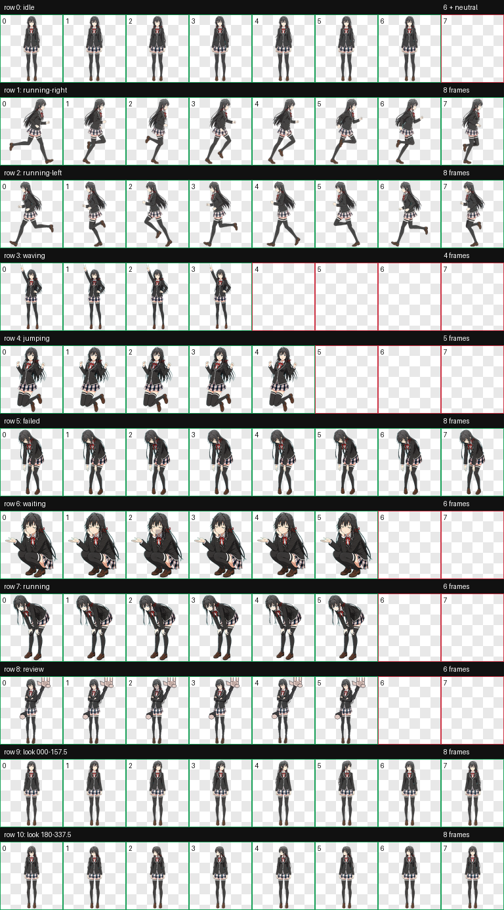
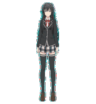

# yukino-coding-company

[English](README.en.md) · [安装指南](docs/INSTALLATION.md) · [交互设计](docs/INTERACTION_DESIGN.md) · [动画协议](docs/SPRITE_CONTRACT.md) · [维护手册](docs/MAINTENANCE.md)

一个非官方、非商业的雪之下雪乃风格 Codex v2 动态宠物项目。它采用正常动漫人体比例与 galgame 式表演，但把事件动作改成在原生尺寸下一眼能懂的全身姿态：举手致意、屈膝张臂拒触、低头垂肩失败、蹲下托掌等待、弯腰检查，以及叉臂举起✌️完成。

> [!IMPORTANT]
> 这是同人衍生项目，与 OpenAI、渡航、小学馆、动画制作委员会及相关权利方均无官方关联。角色与原作相关权利归各自权利方所有。仓库中的代码和文档可按 MIT 条款使用；角色衍生精灵图不在 MIT 授权范围内，详见 [ASSET_NOTICE.md](ASSET_NOTICE.md) 与 [LICENSE](LICENSE)。



## 单次慢速运行效果


这张合并动画直接从最终 `pet/spritesheet.webp` 生成。六个事件动作均按运行时补丁的真实规则展示：动作序列只播放一轮、每帧时长为原生 Codex 的 2 倍，动作完成后切回待机。网格中的每个宠物区域保持原生 `192x208`，没有放大来掩盖低分辨率表现。

## 使用 Coding Agent 安装（推荐）

如果你正在使用 Codex、Claude Code、Cursor Agent 或其他能够执行终端命令的 coding agent，请把下面整段话原样发送给 agent。它会完成克隆、验证、安装和结果检查：

```text
请为我安装这个 Codex 自定义宠物项目：

仓库：git@github.com:lu-xury/yukino-coding-company.git
备用 HTTPS：https://github.com/lu-xury/yukino-coding-company.git

请严格执行：
1. 将仓库 clone 到一个合适的本地目录；如果已经存在则安全地 git pull，不要覆盖未提交修改。
2. 进入仓库，使用 Python 3 创建临时虚拟环境并安装 requirements-dev.txt，然后运行：
   python scripts/validate_pet.py
3. 只有验证通过后，创建目录：
   ~/.codex/pets/yukino-yukinoshita
4. 只复制以下两个文件到该目录：
   pet/pet.json
   pet/spritesheet.webp
5. 确认 pet.json 中 spriteVersionNumber 为 2，spritesheet.webp 为 1536x2288，并确认安装文件与仓库文件 SHA-256 一致。
6. 不要删除或修改我的其他 Codex 宠物。
7. 安装完成后告诉我：打开 Codex 桌面端的 Settings > Pets，点击 Refresh，选择“雪之下雪乃”，然后输入 /pet 或选择 Wake Pet；如果使用 Codex CLI，则输入 /pets 或 /pet 选择并唤醒宠物。
8. 如果写入 ~/.codex 需要权限，请先向我请求批准，不要绕过权限限制。
```

## 手动安装

macOS 可直接双击 `Install Yukino Pet.command`，或在终端运行：

```bash
./install-to-codex.sh
```

双击入口会在安装宠物后询问是否应用版本锁定的单次慢速运行时补丁；shell 安装器本身只复制并校验宠物文件。

### 1. 克隆仓库

SSH：

```bash
git clone git@github.com:lu-xury/yukino-coding-company.git
cd yukino-coding-company
```

没有配置 GitHub SSH 时使用 HTTPS：

```bash
git clone https://github.com/lu-xury/yukino-coding-company.git
cd yukino-coding-company
```

### 2. 验证宠物包

推荐先运行仓库自带的验证器。它会检查 manifest、图集尺寸、11 行布局、使用帧、透明空槽、色键残留和 v2 版本号。

macOS / Linux：

```bash
python3 -m venv .venv
source .venv/bin/activate
python -m pip install -r requirements-dev.txt
python scripts/validate_pet.py
```

Windows PowerShell：

```powershell
py -m venv .venv
.\.venv\Scripts\Activate.ps1
python -m pip install -r requirements-dev.txt
python scripts/validate_pet.py
```

成功时会输出 `validation=pass`。

### 3. 复制到 Codex 宠物目录

macOS / Linux：

```bash
mkdir -p ~/.codex/pets/yukino-yukinoshita
cp pet/pet.json ~/.codex/pets/yukino-yukinoshita/pet.json
cp pet/spritesheet.webp ~/.codex/pets/yukino-yukinoshita/spritesheet.webp
```

Windows PowerShell：

```powershell
$dest = Join-Path $HOME ".codex\pets\yukino-yukinoshita"
New-Item -ItemType Directory -Force -Path $dest | Out-Null
Copy-Item pet\pet.json (Join-Path $dest "pet.json") -Force
Copy-Item pet\spritesheet.webp (Join-Path $dest "spritesheet.webp") -Force
```

安装完成后的目录应为：

```text
~/.codex/pets/yukino-yukinoshita/
├── pet.json
└── spritesheet.webp
```

### 3.1 macOS 单次慢速补丁（Codex 26.721.41059）

`pet.json` 本身不能控制速度或重复次数。此仓库提供一个严格锁定版本、可恢复的本地补丁：把非待机动作从三轮改为一轮，并把每帧时长变为原来的 2 倍。

```bash
python3 scripts/patch_codex_pet_runtime.py check
python3 scripts/patch_codex_pet_runtime.py apply --acknowledge-signature-change
```

该操作会修改已安装的应用包，因此厂商代码签名将不再保持原状，macOS 也可能要求重新授予 Codex 的“文件与文件夹”权限。补丁会先把原始 `Info.plist` 和 `app.asar` 备份到 `~/.codex/backups/yukino-pet-runtime/`，遇到其它 Codex 版本会拒绝写入。恢复命令：

```bash
python3 scripts/patch_codex_pet_runtime.py restore
```

应用补丁或恢复后都需要完全重启 Codex。Codex 自动更新后应先运行 `check`，不要强行套用旧版本补丁。

### 4. 在 Codex 中打开宠物

Codex / ChatGPT 桌面端：

1. 完全打开或重新启动应用。
2. 打开 **Settings > Pets**。
3. 点击 **Refresh**。
4. 选择 **雪之下雪乃**。
5. 在聊天输入 `/pet`，或从命令菜单选择 **Wake Pet**。
6. 再次输入 `/pet` 或选择 **Tuck Away Pet** 可收起宠物。

Codex CLI：

1. 启动交互式 Codex CLI。
2. 输入 `/pets` 或 `/pet` 打开宠物选择器。
3. 选择 **雪之下雪乃**。
4. 输入 `/pets off` 可关闭终端宠物。

终端动画需要 iTerm2 3.6+、Kitty graphics 或 Sixel 支持；tmux、Zellij 以及 Codex IDE 扩展不提供宠物浮层。桌面端是完整体验。

更完整的安装、更新、卸载和故障排查见 [docs/INSTALLATION.md](docs/INSTALLATION.md)。

## 设计特点

- Codex v2 图集：`1536x2288`，8 列 × 11 行，单格 `192x208`。
- 正常 6.5–7 头身动漫比例，不使用 Q 版或卡通小人造型。
- 九类标准状态：待机、左右移动、招手、悬停反应、失败、等待、工作、审阅。
- 16 个顺时针鼠标视线方向，眼睛与头颈主导，躯干保持 galgame 式稳定。
- 悬停采用五帧屈膝张臂拒触定格，以大轮廓代替低分辨率下难辨认的细小摇头动作。
- 原生桌面端会把非待机动作固定播放三遍；macOS 26.721.41059 可使用仓库内的版本锁定补丁改为单次播放并将帧时长放慢 2 倍。
- 事件语义主要由举手、屈膝张臂、低头垂肩、蹲下托掌、弯腰和叉臂✌️等全身轮廓表达，而不是依赖难以辨认的微表情。
- 原生 `192x208` 清晰度通过高对比眼眉、发饰、制服滚边、手部和鞋子轮廓，以及简化碎小纹理来保证。
- WebP 使用无损 RGBA；最终产物与 PNG 像素一致。
- 色键清理、图集结构、盲方向测试和独立视觉 QA 均已通过。


> 预览 GIF 只展示一轮图集动作，便于检查每一帧；原生 Codex 会重复三轮，应用本仓库补丁后只播放一轮。

合并运行效果可通过以下命令从最终图集重新生成：

```bash
python scripts/generate_runtime_showcase.py
```

## 什么操作会触发什么动作

| 操作或任务状态 | Codex 动画行 | 雪乃的动作 |
| --- | --- | --- |
| 第一次唤醒宠物 | `waving` | 保持举手致意定格（仅轻微眨眼/呼吸）。 |
| 鼠标进入宠物区域 | `jumping / hover` | 保持张臂拒触定格（不再循环摇头）。 |
| 向右拖动宠物 | `running-right` | 朝屏幕右侧奔跑。 |
| 向左拖动宠物 | `running-left` | 朝屏幕左侧奔跑。 |
| 鼠标在宠物周围移动 | `look directions` | 眼睛、头颈和头发按 16 个方向追随指针。 |
| 任务正在执行 | `running` | 保持明显弯腰检查定格。 |
| Codex 等待批准、回答或其他输入 | `waiting` | 保持蹲下等待/思考定格。 |
| 任务失败或被阻塞 | `failed` | 保持低头垂肩、双臂下垂的明确失败姿态。 |
| 任务完成且有未读结果 | `review` | 保持叉臂站姿并举起前景✌️完成手势。 |
| 没有活动事件 | `idle` | 安静呼吸、眨眼和观察。 |

原生桌面端会把每个非待机动作固定播放三遍，然后进入慢速待机；宠物清单没有可用的“只播放一次”或自定义帧时长字段。本仓库针对 macOS Codex 26.721.41059 提供可恢复的运行时补丁，使交互动作只播放一轮并将帧时长放慢 2 倍。技术证据、逐行时长和完整映射见 [交互动作设计](docs/INTERACTION_DESIGN.md)、[动画协议](docs/SPRITE_CONTRACT.md) 与 [安装指南](docs/INSTALLATION.md)。

| 招呼 | 失败 / 受阻 | 等待输入 |
| --- | --- | --- |
|  |  |  |

| 专注工作 | 审阅认可 |
| --- | --- |
|  |  |

## 仓库结构

```text
yukino-coding-company/
├── pet/                  # 可直接安装的最终宠物包
├── previews/             # 接触表、视线表与各事件动作 GIF
├── qa/                   # 机器验证与视觉 QA 证据
├── scripts/              # 独立发布验证器
├── docs/                 # 设计、协议、安装和维护文档
├── .github/              # CI、Issue 与 PR 模板
├── README.md
├── README.en.md
├── CONTRIBUTING.md
├── ASSET_NOTICE.md
└── LICENSE
```

## 文档

- [安装、更新、卸载与故障排查](docs/INSTALLATION.md)
- [项目目标和技术结构](docs/PROJECT_OVERVIEW.md)
- [人设与交互动作设计](docs/INTERACTION_DESIGN.md)
- [Codex v2 精灵图协议](docs/SPRITE_CONTRACT.md)
- [质量保证与验收门槛](docs/QUALITY_ASSURANCE.md)
- [更新、发布和维护流程](docs/MAINTENANCE.md)
- [贡献指南](CONTRIBUTING.md)
- [角色资产与版权说明](ASSET_NOTICE.md)

## 本地验证

```bash
python scripts/validate_pet.py
```

预期核心结果：

```text
validation=pass
spriteVersionNumber=2
atlas=1536x2288
```

GitHub Actions 会在 push 和 pull request 时执行同一验证。

## 更新已安装宠物

```bash
git pull --ff-only
python scripts/validate_pet.py
cp pet/pet.json ~/.codex/pets/yukino-yukinoshita/pet.json
cp pet/spritesheet.webp ~/.codex/pets/yukino-yukinoshita/spritesheet.webp
```

之后回到 **Settings > Pets** 点击 **Refresh**，必要时重启应用。

## 许可与使用边界

- `scripts/`、`.github/` 和原创文档：MIT。
- `pet/spritesheet.webp`、预览图和其他角色衍生美术：不授予角色或商业再利用权。
- 不得暗示本项目获得 OpenAI 或原作权利方背书。
- 建议仅用于个人、学习、研究和非商业同人用途。
- 若权利方提出有效请求，维护者应及时下架相关资产。

详见 [LICENSE](LICENSE) 和 [ASSET_NOTICE.md](ASSET_NOTICE.md)。

## 官方 Codex 使用参考

宠物的选择与唤醒流程参考 OpenAI Codex 手册的 Pets 章节：桌面端在 **Settings > Pets** 中选择宠物，再用 `/pet` 或 **Wake Pet** 唤醒；CLI 使用 `/pets` 或 `/pet`。

- <https://learn.chatgpt.com/docs/pets>
- <https://learn.chatgpt.com/docs/reference/settings#pets>
