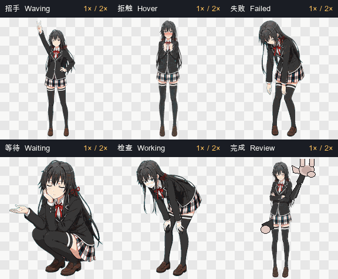
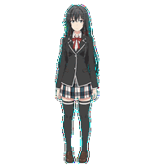

# Interaction and character design

## Character principles

The pet is designed around a restrained interpretation of Yukinoshita Yukino:

- cool, intelligent, observant, and self-possessed;
- tsundere warmth appears through small involuntary cues, not broad comedy;
- eye direction, eyelids, eyebrows, chin, head, hair, and shoulders carry most
  emotional information;
- feet, hips, body scale, and baseline remain stable whenever possible;
- no chibi proportions, celebratory bouncing, exaggerated surprise, or
  attention-seeking gestures.

The native cell is only `192x208`, so readable expression is achieved through
clear silhouettes and large facial landmarks rather than fine micro-detail.

## Operation-to-animation mapping

The mapping below describes observable Codex desktop behavior in app build
`26.721.41059`. A custom pet supplies artwork for fixed runtime states; it does
not choose which application event activates a state.

| User or task operation | Runtime state / row | Yukino action |
| --- | --- | --- |
| Wake the pet for the first time | `waving`, row 3 | Holds a raised-hand greeting pose with only a tiny blink/bob. |
| Move the pointer onto the pet | `jumping`, row 4 | Blushes and moves through left stop hand, center arm fold, right stop hand, and a matched standing recovery. |
| Drag the pet toward screen-right | `running-right`, row 1 | Runs toward screen-right while being dragged. |
| Drag the pet toward screen-left | `running-left`, row 2 | Runs toward screen-left while being dragged. |
| Move the pointer around the pet while look tracking is active | rows 9–10 | Eyes, head, neck, and hair follow the pointer through sixteen directions. |
| A task is actively loading or working | `running`, row 7 | Holds a deep waist-bent close-inspection pose while the task runs. |
| Codex needs approval, an answer, or other user input | `waiting`, row 6 | Holds a compact crouch wait/thinking pose until input arrives. |
| A task is blocked or fails | `failed`, row 5 | Holds a head-down, drooped-shoulder failure pose with both arms hanging clearly. |
| Work completes and has unread output ready | `review`, row 8 | Holds an arms-crossed stance with a large foreground victory/peace hand. |
| No event state is active | `idle`, row 0 | Quiet breathing, blinking, and composed observation. |

Status rows may be easy to miss if the task transition happens while the pet
is covered, off-screen, or unattended. Codex starts the action when the state
changes; it does not wait for the user to look at the pet.

## Stock playback and the optional runtime patch

The desktop renderer deliberately expands every non-idle row into three copies
of the same frame sequence and then switches to the slow idle loop. In compact
form, its playback rule is:

```text
non-idle state = action + action + action + slow idle loop
```

This is application behavior, not three duplicated animations inside this
spritesheet. `pet.json` has no supported repeat-count or per-frame-speed field.

For macOS build `26.721.41059` (`5848`), the repository's optional runtime
patch changes the renderer rule to:

```text
non-idle state = action at 2x frame duration + slow idle loop
```

The patch is version-locked, updates the target ASAR file and integrity hashes,
and creates a restorable backup. It does not alter the atlas contract.



The showcase is generated directly from the final atlas. Each panel retains a
native `192x208` character area, runs one action cycle at `2x` frame duration,
and then displays the idle frame rather than restarting the gesture.

## Why the hover row has five frames

The Codex v2 contract fixes row 4 to five used cells. Columns 5–7 must remain
transparent, so adding three visible frames would produce an invalid atlas and
would not create an eight-frame runtime loop.

Smoothness is therefore created through restrained movement and stable
registration, not by violating the frame contract.

### Five-frame hover acting plan

1. **Anticipation** — blushes with both hands held clearly near the chest.
2. **Left stop** — turns slightly and presents one large stop palm.
3. **Center fold** — returns through center with both arms visibly gathered.
4. **Right stop** — presents the matching stop palm on the other side.
5. **Recovery** — returns to the same chest-level anticipation pose so the
   following idle frame does not create a full-body hard cut.



The documentation GIF shows one five-frame row cycle. Stock Codex repeats that
cycle three times; the optional supported-build patch plays it once at twice
the stock frame duration.

## Mouse-look mechanics

The look system follows a clockwise sixteen-direction loop:

```text
000 up → 022.5 → 045 → 067.5 → 090 right → 112.5 → 135 →
157.5 → 180 down → 202.5 → 225 → 247.5 → 270 left →
292.5 → 315 → 337.5 → 000 up
```

The body uses a galgame standing-sprite lock:

- feet, legs, hips, skirt, and lower torso stay nearly frontal;
- eyes and eyelids lead;
- head and neck follow;
- shoulders follow only slightly;
- hair and red ribbons trail continuously;
- whole-sprite rotation, skewing, or broad raster warping is forbidden.

The four cardinals must be unmistakable. Near-axis intermediate directions may
be subtle if the ordered loop remains coherent and does not reverse.

## State priorities

Pets communicate activity rather than changing task behavior. Typical runtime
status mapping is:

- **Running** → focused work row;
- **Needs input** → waiting row;
- **Ready** → review row;
- **Blocked** → failed row.

The visual design should remain useful and low-distraction during long work.

## Perceived speed and clear silhouettes

Codex owns the animation row timings and used-cell counts. `pet.json` has no
supported per-action speed or repeat-count field. The optional runtime patch is
outside the pet manifest, so clear acting still relies on large full-body
silhouettes:

| State | Dominant readable silhouette |
| --- | --- |
| waving | raised open palm plus visible formal bow |
| jumping / hover | red-faced left stop, center arm fold, right stop, recovery |
| failed | lowered head, drooped shoulders, and both arms hanging |
| waiting | compact low crouch with an open waiting/thinking palm |
| running | 25–35 degree waist bend for close inspection |
| review | arms-crossed stance plus oversized foreground peace hand |

The silhouette is intentionally much larger than the facial cue. A blink,
eyebrow change, hair settle, or blush supports the pose but never carries the
meaning alone.

## Native-size clarity strategy

The runtime cell remains fixed at `192x208`, so facial readability cannot be
improved by shipping a larger incompatible atlas. The current art instead:

- fills the safe cell height while preserving normal 6.5–7-head proportions;
- uses darker, cleaner eye, eyelid, eyebrow, and mouth landmarks;
- keeps red ribbons, the red bow, and white blazer piping high contrast;
- separates hands and bent elbows from the dark hair and blazer silhouette;
- simplifies hair strands, plaid micro-lines, fabric noise, and low-contrast
  shading that would blur after downsampling.
