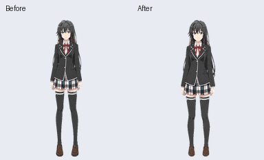
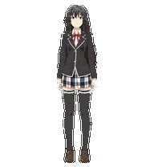

# 原像素手工修复版

原云端素材的跳跃帧始终贴地，待机行的空余格留有角色图像，部分视线帧的上下象限与顺时针方向不对应。本版通过重排、镜像和整数位移修复，保留原脸、服装、身形与像素颜色。

## 素材与预览

| 文件 | 内容 |
| --- | --- |
| [`pet/manual-v2/pet.json`](../pet/manual-v2/pet.json) | v2 manifest，保留原安装 ID |
| [`pet/manual-v2/spritesheet.webp`](../pet/manual-v2/spritesheet.webp) | 无损 RGBA 图集，与云端更新后下载的成品逐像素相同 |
| [`qa/manual-v2.json`](../qa/manual-v2.json) | 脱敏验证摘要与素材哈希 |
| [`previews/manual-v2/contact-sheet.png`](../previews/manual-v2/contact-sheet.png) | 完整帧表 |
| [`previews/manual-v2/look-directions.png`](../previews/manual-v2/look-directions.png) | 16 个顺时针方向 |

下图左侧为修复前的云端跳跃动作，右侧为本版。每个角色区域保持原生 `192×208`。





## 修改范围

- 跳跃行复用原待机帧 `0, 1, 2, 1, 0`，纵向位移为 `0, -1, -3, -1, 0` 像素。起跳与落地均回到原待机首帧，脚底位置依次为 `203, 202, 200, 202, 203`。
- 视线两行重排原姿态并按需整体镜像。保留原尺寸，所有方向的脚底位置均为 203，闭环中心位移约 0.71 像素。
- 清空未使用单元格，包括待机行第 7 格。
- 待机、左右移动、挥手、失败、等待、工作、检查八组动作的已用帧与原云端素材逐像素相同。
- 全部改动采用原像素，没有重绘、缩放、重采样或可见像素裁切。

原素材头顶只有 5 像素余量，因此轻跳高度为 3 像素，顶端仍保留 2 像素。视线中间角度的俯仰较轻，原上下姿态家族的细微肩部高度差仍保留。验证使用已审阅的 3 像素跳跃门槛。

## 契约与验证

本版已完成云端格式验证、更新和下载复验。图集为 `1536×2288`，8 列、11 行，单元格 `192×208`。各行已用帧数为 `6, 8, 8, 4, 5, 8, 6, 6, 6, 8, 8`，共 73 格，15 个空格完全透明。

```bash
python scripts/validate_pet.py
python scripts/validate_pet.py --variant manual-v2
```

第一条命令同时检查默认发行包与本版，第二条单独检查本版。现有 CI 运行第一条命令。该云端版本采用六格待机契约；默认桌面包采用带 neutral 格的七格待机契约。默认安装命令与运行时补丁继续使用根目录 `pet/` 中的发行包。本目录用于保存本次云端成品，在要求 neutral 格的桌面运行时中需先确认兼容性。

角色衍生素材的权利说明沿用 [ASSET_NOTICE.md](../ASSET_NOTICE.md)，素材不属于 MIT 代码授权范围。
